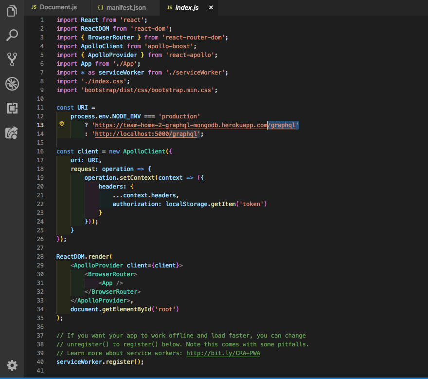
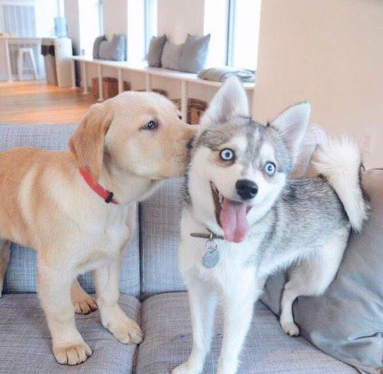

# Part 1 - Individual Accomplishments this Week

Github Handle: [tryingtokeepup](https://github.com/tryingtokeepup)

At least for me, this week was way better than the previous week. We were able to get everything up and running, our backend is finally able to talk to front-end without

## Tasks Pulled

Since our project requires us to add on new functionality to an already existing app, my goal this week was to understand the existing code. As such, all of my pull requests this week either adds comments to existing code or updates READMEs in order to better help my teammates:

### Ticket 1: Added comments to Readme.md

* [Github](https://github.com/Lambda-School-Labs/labs-team-home/pull/247)
* [Trello](https://trello.com/c/oyd8ltxC/37-add-comments-to-readme)

### Ticket 2: Even more comments!

* [Github](https://github.com/Lambda-School-Labs/labs-team-home/pull/247)
* [Trello](https://trello.com/c/oyd8ltxC/37-add-comments-to-readme)

### Ticket 3: Actually did something useful - redirected our repo to the right backend

* [Github](https://github.com/Lambda-School-Labs/labs-team-home/pull/248)
* [Trello](https://trello.com/c/jTXWoQ2d/17-learn-graphql-apollo-prisma-kai)

### Ticket 4: Last pull, env variable update

* [Github](https://github.com/Lambda-School-Labs/labs-team-home/pull/271)
* [Trello](https://trello.com/c/jTXWoQ2d/17-learn-graphql-apollo-prisma-kai)

## Detailed Analysis

Yikes, this whole week was difficult for me. Need that dog above to keep me sane, for real. But Ticket 4 was me finally breaking down and asking the original team for help. I should probably screen shot our convo on zoom, but we as a team basically decided that enough was enough, and wasting another day (after using up 3 days of dev time) on trying to blindly get Auth0 was not possible. So I went ahead and contacted the previous team for some help deploying with Auth0, and they immediately sent their old env variables, even though that was supposed to be an internal secret.

Goes to show you that sometimes, just asking for a little help can help solve your most intractable problems. I think we are still having a little issue with that, but I think that now, we can at least get something up on our personal development machines.

(editor note: add like 3 screenshots or something)

# Part 2 - Milestone Reflections

So, I think our Milestone this week was to work on TDD and complete it, and get something up and running on our project.

So, TDD. I am actually really proud of my work on this, because I designated myself scribbler-in-chief. I wrote out most of the document in its roughest form, and let Bondor, Elieen, and Nedim clean it up, shorten and tighten it. I provide the rock, roughly chisel out what it needs to look like, and let the rest add the details and the prettiness. It was very effective, and I think we knocked it out of the park. I only hope that we can actually do most of what we put out to accomplish. If we can actually get Auth0 to work and our database to properly link up to the backend, we might have something beautiful come out of week 2.

For the whole competitor thing, we basically as a team built a team BaseCamp project, and checked out the Docs feature they had. It is basically what we are going to build out, and boy, was it fun to use. It was a really cool component, and we came out with a newfound appreciation of how deceptively simple it was as a feature, and how much work we probably will have to put in just to get it to work.

Again, this points to my original frustration: I want to get that to work right away, but for now, there is nothing I can do on it until I actually get access to the overall site itself, but we keep getting blocked by Auth0. I think our team will just have to bash our heads against the wall this weekend until we can breakthrough to the other side.
