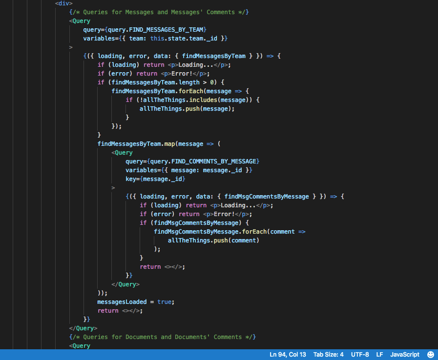
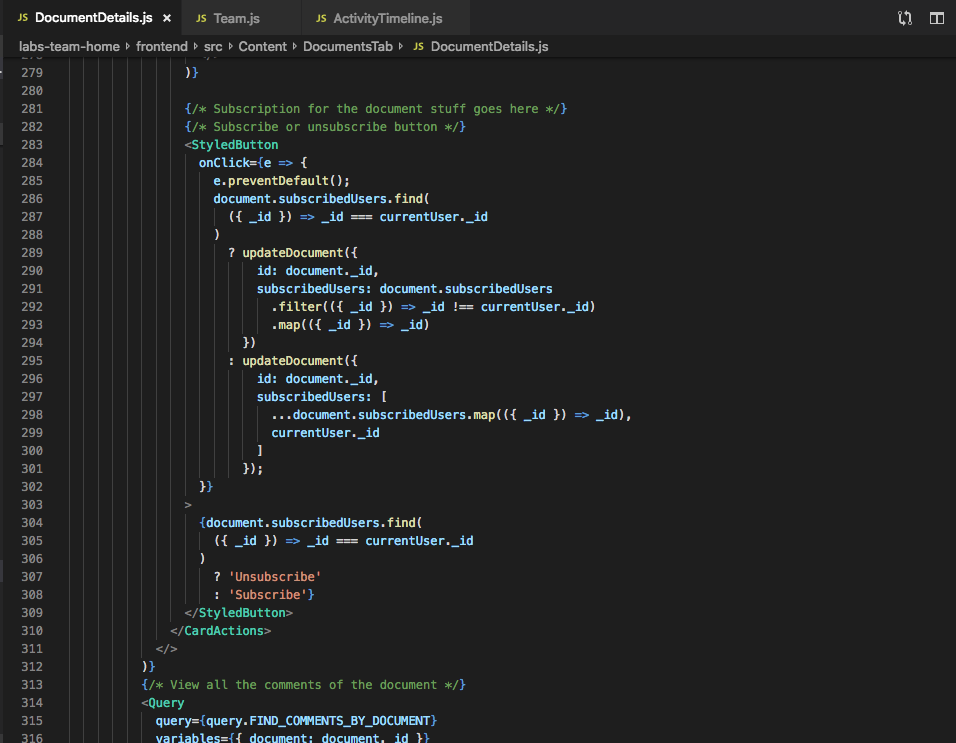

# Part 1 - Individual Accomplishments this Week

Github Handle: [tryingtokeepup](https://github.com/tryingtokeepup)

This week has proven how a great team can make an almost impossible load of work almost easy to bear. Almost fun. 

Actually, scratch that, this week was fun. Exhausting, but fun. 

I am going to go on a small tangent, and actually type out something I was thinking about. For a long time, I have fantasized about making a startup, and I have promised myself and a lot of those around me that I will make the leap before I enter my 30s (about 4-5 years off). But the big thing that kept scaring me was if I could deal with the load, that back-breaking, soul-crushing realization that you will be working 90 hour weeks for at least 2 years (if you are lucky) to get the thing off the ground.

Doing Lambda gave me a lot more confidence that I can take the emotional toll, but it did not nudge my prior that I would not enjoy it.

Doing Labs, however, has shown me that I can enjoy this trial, IF AND ONLY IF I HAVE AN AMAZING TEAM. That team doesn't need to be ideologically the same, or all the same gender, or anything like that. It just needs to like the same memes.

In a more serious analysis, what I mean by the above is that there has to be a shared sense that we don't take ourselves too seriously. We also have to balance that frivolity with enough seriousness and conscientiousness that we actually get work done. This balance is extraordinarily hard to get right, but I got lucky. I got the best team I could ask for. I am so glad right now.

## Tasks Pulled

This week, in Technical Accomplishments:

Well, mostly got Activity Timeline working, but we are having lots of bugs there. That was Eileen and my big battle this week. Most of it is rendering (thanks to Eileen), but now its not picking up Comments on Messages and Comments on Documents. (*Edit: Nevermind, Eileen is a magician. Lol. all fixed on that end.)

### Ticket 1:

* [Github](https://github.com/Lambda-School-Labs/labs-team-home/pull/326)
* [Trello](https://trello.com/c/jTXWoQ2d/17-learn-graphql-apollo-prisma-kai)

### Ticket 2:

* [Github](https://github.com/Lambda-School-Labs/labs-team-home/pull/338)
* [Trello](https://trello.com/c/jTXWoQ2d/17-learn-graphql-apollo-prisma-kai)

### Ticket 3:

* [Github](https://github.com/Lambda-School-Labs/labs-team-home/pull/341)
* [Trello](https://trello.com/c/jTXWoQ2d/17-learn-graphql-apollo-prisma-kai)

### Ticket 4:

* [Github](https://github.com/Lambda-School-Labs/labs-team-home/pull/350)
* [Trello](https://trello.com/c/jTXWoQ2d/17-learn-graphql-apollo-prisma-kai)

that's all it was for me.

## Detailed Analysis

I was tasked to help Eileen with the Activity Timeline this week as Priority 2, and Priority 1 was getting the tag functionality implemented for the Documents. The following 4 screenshots shows the end product.

There is nothing more to be said on this. It worked, we got the code running, lots of sweat and tears, and pair programming. Eileen and I went through basically the entirety of backend/frontend this week, and it was a blast doing so.

Screenshots:

, but this was my primary duty. Eileen helped tremendously.")

# Part 2 - The Challenges of Working as a Team

So, in the above sections of the blog, I talked mostly about all the positive stuff about working as a team. Here, I guess I will discuss the sausage-making-process on how we got there. 

The biggest challenge, ironically, about working in a team this effective at getting work done is actually being able to push up changes that were not already done and submitted by other team-members. I have finally come-in-on-my-own and know that I am becoming a very effective programmer, but I work very procedurally and slowly, and I like to understand how the entire code-base works before I make a functional change to how it works. 

My team works almost too fast for that to be possible. Whenever I feel like I finally grasp what the current iteration of the codebase looks like, I do a git pull and instantly a good 20 percent of the codebase has changed or has been modified enough that I need to once again analyze everything from the ground-up. This might not actually be necessary to actually get a grasp of what is going on, but it is part and parcel of my perfectionist instincts. 

I think I am beginning to let go of this, as part of the whole sink-or-swim experience of Lambda, but its accelerating in Labs, as I just have to be okay not understanding EVERYTHING about what I am working on. This is almost traumatizing for me, but I am glad I am having to face it now, rather than in the future at work. I have to trust my teammates and trust that they know what they are doing and that they will let me know if something is amiss. 

Besides, I can dig in on the weekends and read everything at my leisure then lol.

I think the other reason this is good for me is that I usually hedge against being disliked on teams by doing a disproportionate amount of work. This unfortunately sometimes leads me to start to disdain those on my team, as I start thinking that they are not pulling their fair share (and how can they? I am hogging all the work so that they don't dislike me! wait thats circular logic help me).

This is impossible here, as it would literally kill me to do more work, and my teammates are as, if not more, competent than me. Actually doing my part of the work is now helping me learn to, you know, actually be a team-member, and focus on my tasks and trust in the overall group. This is something I HAVE NEVER EXPERIENCED EVER in my whole academic career, and that itself is a damning indictment on the education system and a boost for Lambda and coding in general. 

So yeah, Lambda is great, team is great, life is great. 

I just got to learn even more, get interviews, work on algos, and get a handle on CS related topics. So, more and more work, but it's going good so far.
