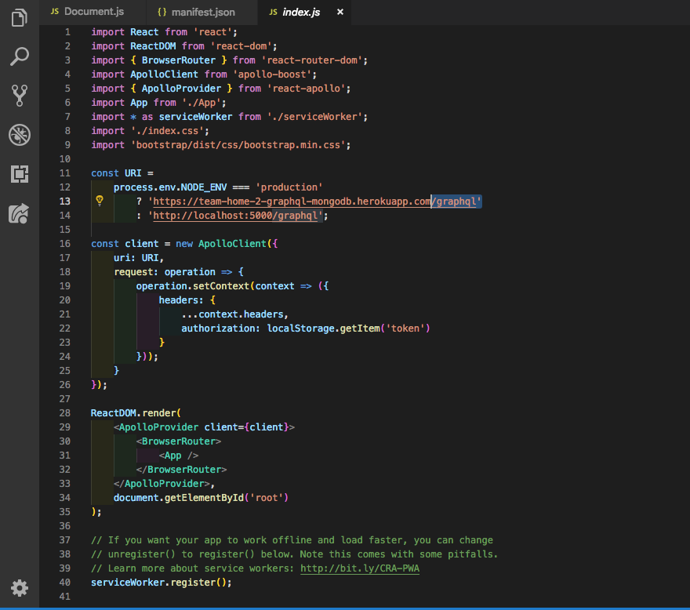
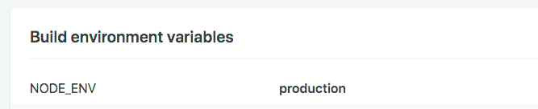
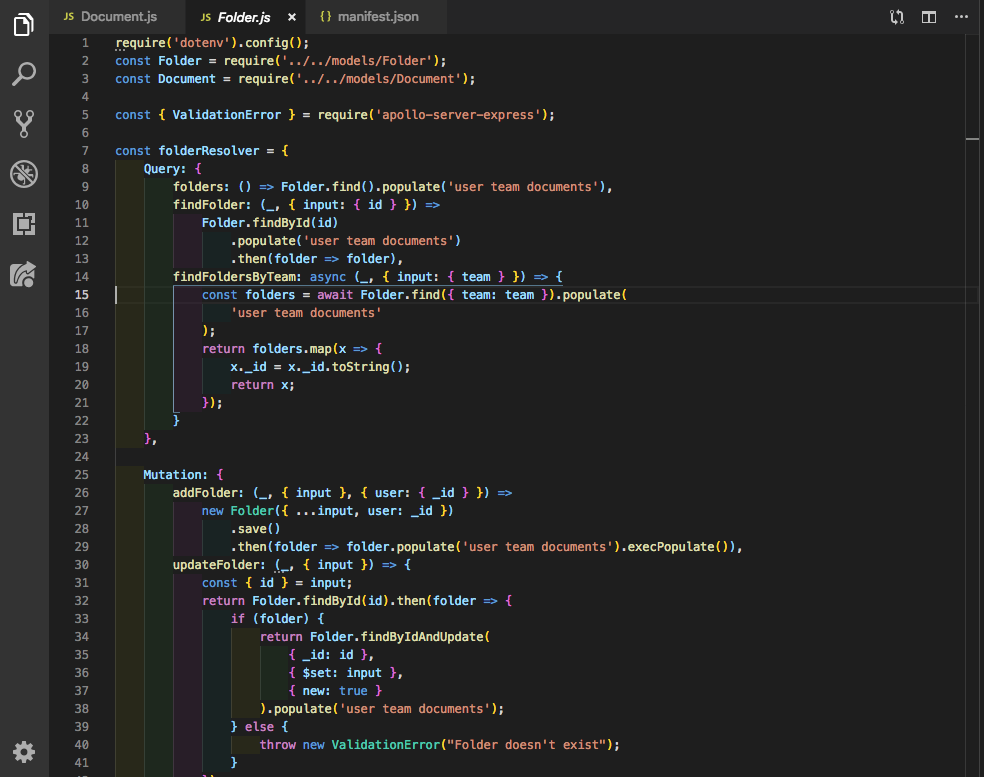

# Part 1 - Individual Accomplishments this Week

Github Handle: [tryingtokeepup](https://github.com/tryingtokeepup)

At least for me, this week was way better than the previous week. We were able to get everything up and running, our backend is finally able to talk to front-end without Auth0 errors. Our team also stayed incredibly cohesive throughout the week, thanks to a constant Zoom session that we could pop into at anytime. In all honesty, I would have probably collapsed into exhaustion a lot sooner if I didn't have my teammates to constantly cheer me up throughout the week. 

My big accomplishment this week was finally nailing down a bug that made it impossible for our deployed front-end to communicate with our deployed back-end. Working closely with Nedim, who has for the past two weeks been my back-end partner, we finally figured out that it was a missing environmental variable that slipped through the cracks of the docs that was causing the issue. 

This was a glorious find, as it took me the better part of two days to finally pinpoint the issue. It is almost galling that for all the effort I put into finding the variable, it was only a line of code in the end and a Netlify variable that was missing. Oh well.

## Tasks Pulled

Other than the .env find, I fleshed out the backend schema, resolvers, and models with Nedim, and got better aquainted with GraphQL. I am by no means a master at Prisma and GraphQL, but I am starting to get more confident that I can build something pretty complex with those technologies with last week's experience.

### Ticket 1: Uncommented and documented the login function in NavResponse.js.

* [Github](https://github.com/Lambda-School-Labs/labs-team-home/pull/277)
* [Trello](https://trello.com/c/oyd8ltxC/37-add-comments-to-readme)

### Ticket 2: My first attempt into radically changing the backend environmental variables to see where the connection bug was originating.

* [Github](https://github.com/Lambda-School-Labs/labs-team-home/pull/286)
* [Trello](https://trello.com/c/oyd8ltxC/37-add-comments-to-readme)

### Ticket 3: Mostly a trivial fix, but helped my team fix a merge issue and repaired the master branch from its merge conflicts.

* [Github](https://github.com/Lambda-School-Labs/labs-team-home/pull/294)
* [Trello](https://trello.com/c/jTXWoQ2d/17-learn-graphql-apollo-prisma-kai)

### Ticket 4: Finally. FINALLY. Found the env variable that was causing all the pain. Aggh.

* [Github](https://github.com/Lambda-School-Labs/labs-team-home/pull/301)
* [Trello](https://trello.com/c/jTXWoQ2d/17-learn-graphql-apollo-prisma-kai)

There were a few more pull requests (3 total), but they were trivial in nature. Most of my schema work for GraphQL is in Nedim's pull requests, so I might reference that in the future.

## Detailed Analysis

Wow, this was a crazy week. I mentioned most of my thoughts above, but the most important part of the whole week was persevering and not giving up on the hunt for the bug. Nedim and I went through probably every single possible combination of environmental variable and line of code pertaining to authentication in our code base. I spent probably a good 8 hours just reading documentation on Auth0, and even set up a complete parallel setup of our project on my own Netlify, complete with my own rollout of Auth0 so that I could test out what our app was missing. Our Project Managers actually admonished us that we should have brought this to the attention to the dedicated help group for Labs for consultation, as it took so much time for us to find the problem.

While going for help might have solved the issue faster (on that, I have a little skepticism, as they would have run into the same issue of having to test almost everything and anything to get a handle on the situation, but I dunno), I am really glad I got this fix under my belt. It cost me a lot of sleep and caused Nedim and I a lot of stress, but we squashed it in the end. I also learned a huge amount about how Auth0 really works under the hood (how rules work, how to write rules in standard SQL language and in Javascript), so I feel that the time was well utilized in the end. 

# Part 2 - How we formed a team -

Quick admission: our team kind of had it easy from the get-go; the four of us on the web side have been together from the very beginning. We were all in the same small group, Team Wolf, and we have always been the most tight-knit of all the small groups in a cohort already super tight-knit and small compared to previous cohorts. I have no idea how it turned out this way, but we were lucky.

If anyone wanted advice on how to form such a team, I would advise tons of memes and tons of face to face interaction. Of course, this means that you kind of have to be okay with irreverent humor, but it worked for us. This sometimes makes me wonder if culture fit (in HR speak) is really simply if everyone can join in in the same kind of humor, or at least can be flexible enough to tolerate it. And what if someone is great but they can't find the memes funny? I don't know, but we were fortunate enough not to have to deal with that. 

For group decision making, I think that we have such strong trust in each other and respect for each other's opinions that we all voice our ideas and concerns pretty much without any worry that we will be ignored. I am sure such cohesion disappears in larger groups, but it works great in this group of 6 people. It also helps tremendously that our iOS friends are consummate professionals, and really good people to boot. 

I guess that for me personally, I don't know what I am doing to help out the with the whole "make a great team" thing: it kind of happened organically.
