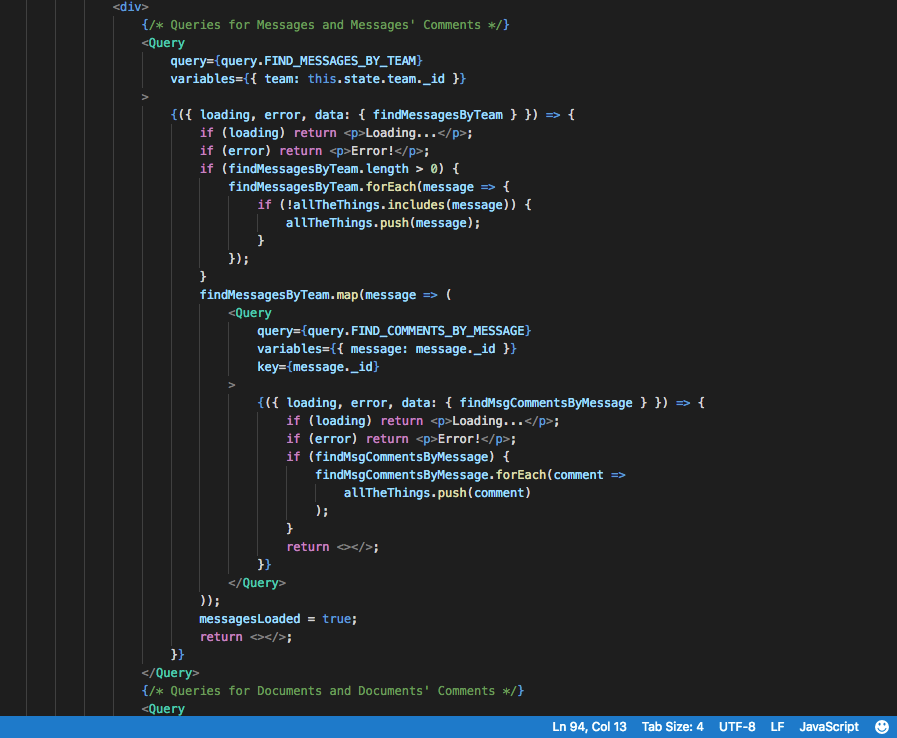
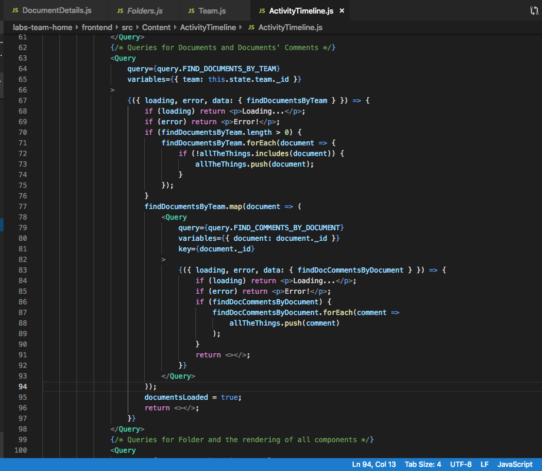
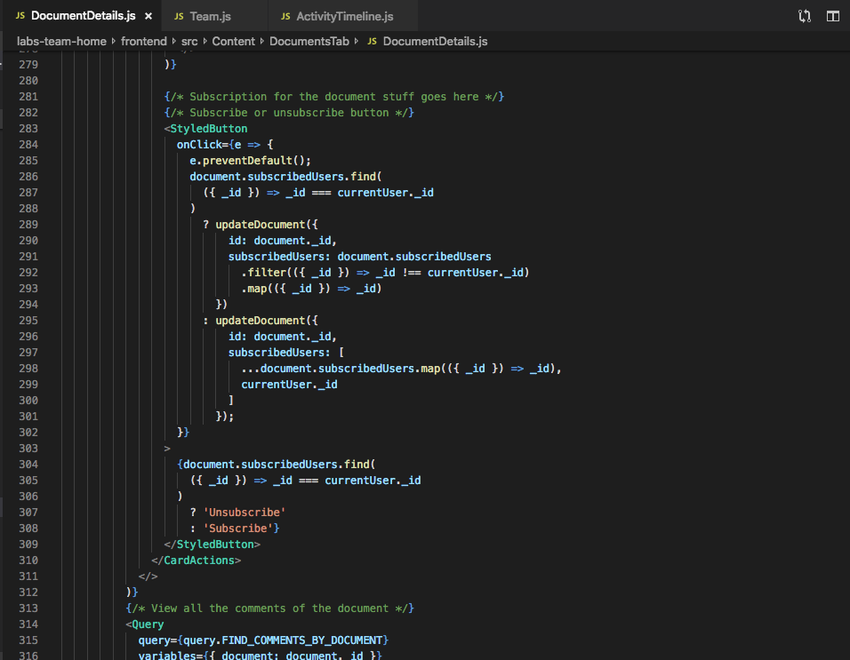

# Part 1 - Individual Accomplishments this Week

Github Handle: [tryingtokeepup](https://github.com/tryingtokeepup)

Week 4! What a month it has been. Been extremely enjoyable working with my team until now, but as we are reaching the end.

## Tasks Pulled

This week, in Technical Accomplishments:

Technical accomplishments? A bunch, but the biggest was helping Bondor with the brand-new, ultra cool Activity Timeline. Compared to the old one, which was really just something that tracked the current state of data on the database, this activity timeline actually now tracks what actions a user is doing inside the document and message components. It was a lot of backend work, a lot of sweat and tears, but we got it to work. Screencaps in the detailed area.

### Ticket 1: Fixed a bunch of bugs in Event.js in backend

* [Github](https://github.com/Lambda-School-Labs/labs-team-home/pull/362)
* [Trello](https://trello.com/c/QW8mvUpD/85-testing-and-fixing-folder-functions-from-last-week)

### Ticket 2: Rebuilt, with Bondor, all the schemas for Event handling. Bugs squashed aplenty.

* [Github](https://github.com/Lambda-School-Labs/labs-team-home/pull/370)
* [Trello](https://trello.com/c/QW8mvUpD/85-testing-and-fixing-folder-functions-from-last-week)

### Ticket 3: Fixed a bunch of nulls being passed from our GraphQL resolvers.

* [Github](https://github.com/Lambda-School-Labs/labs-team-home/pull/384)
* [Trello](https://trello.com/c/QW8mvUpD/85-testing-and-fixing-folder-functions-from-last-week)

### Ticket 4: Quality of life fixes: better and cleaner returns from resolvers, and removed some annoying alerts.

* [Github](https://github.com/Lambda-School-Labs/labs-team-home/pull/395)
* [Trello](https://trello.com/c/QW8mvUpD/85-testing-and-fixing-folder-functions-from-last-week)

Was a good week. 

## Detailed Analysis

This week can be boiled down to: Help Bondor with Activity Timeline, and then try to get some testing done. Honestly, I kind of failed at getting testing implemented: its a bit more complicated than I realized, as it uses packages that we were not taught here in at Lambda. But it seems doable, so I will tackle it over the weekend. 

For the activity timeline, there were all kinds of important things we had to go through, mostly schema related. We built a completely new resolver, schema, and model system to replace what we had before, and Bondor went ahead and removed most of the unnecessary code from the front-end. I am proud that I was able to parlay my limited knowledge of the backend into helping Bondor's Herculean task of making a real Activity Timeline, and I hope everyone can play around with it in the future. 

Note: current screenshots are not updated, making new ones

Screenshots:

, but this was my primary duty. Eileen helped tremendously.")

# Part 2 - The Challenges of Making a Great UI/UX Experience

This will have to be some what abbreviated, as there are a ton of stuff I want to add here, along with pictures, to truly explain what I have yet to learn, but the biggest one was simple: the core team will have difficulty finding UI UX issues, simply because they will have gotten used to those issues. 

It is like someone who teaches a course on some esoteric subject (or math) for a long time; the teacher will not be able to easily gauge what part of the course would be especially daunting to a newcomer without a large amount of input from those students, REGARDLESS of how much initial difficulty that teacher had in understanding the material when they were first introduced to it. You simply acclimate to the difficulty over time, and what was difficult becomes simple with repetition.

This is normally a great thing: look, the thing that was impossible a month ago is now trivial! Look Mah, no hands! But this destroys your sense of perspective, and makes it all the more necessary to drag others completely fresh to your precious project and watch them use your site. Watching those around my hacker house interact with the Sveza app helped me understand that the majority of the problems with the initial had nothing to do with ugly styling (although thats something we worked on too), but had more to do with counter-intuitive app design, like having a pull down button floating at the mid-top of our app instead of being bottom-left as standard, not having the Enter key being the standard button to input text in a input field box, and other little things that seem small at first but add up to a frustrating user experience quickly.

We also worked furiously to make an actually responsive and "real" activity timeline so that our users could actually see what was happening in their team space, and this required a tremendous amount of work in the backend, making new resolvers and models to allow for the new component to do what it says on the can. 
