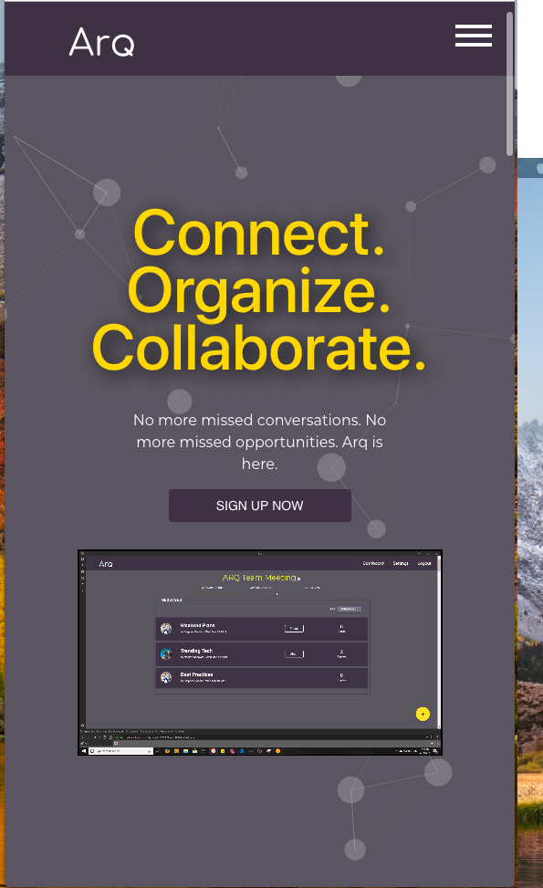

(Editor's note: This first part is a requirement to finish labs, my other thoughts will be in part 2.)

# Part 1 - Individual Accomplishments this Week

Github Handle: [tryingtokeepup](https://github.com/tryingtokeepup)

Week 5. We made it. 

I made it. Without running away. That's going to be a cherished victory.

The main accomplishment this week was being the lead on remaking our landing page, with Eileen being my mentor, confidant, and all-around teacher so that I could make something not completely embarrassing. I was just barely able to get everything responsive by today, Friday morning, and this is by no means a small accomplishment for me, as I have utter dog poop at design, html, and css. It's my true weakness, and I am glad that I had to face my fears by going through this crucible. 

## Tasks Pulled

This week, in Technical Accomplishments:

As above, the big technical accomplishment was making a decent looking landing page. It's not 100 percent feature complete (I want to add better transitions and animations, better shadows for boxes, actual links for privacy and team links, and overall find a way to lighten the backdrop and add non-euclidean geometry into the page to spice it up), but it will suffice for now. It is clean, easy on the eyes, and gets the right information to you. It's not the best landing page in Labs10, but its not the worst, and it does its job on any device size, which was the big technical win for me this week.

Could not have done that without Eileen. Seriously. 

## Major tickets accomplished (Total done: 8)

### Ticket 1:

* [Github](https://github.com/Lambda-School-Labs/labs-team-home/pull/413)
* [Trello](https://trello.com/c/QW8mvUpD/85-testing-and-fixing-folder-functions-from-last-week)

### Ticket 2: 

* [Github](https://github.com/Lambda-School-Labs/labs-team-home/pull/422)
* [Trello](https://trello.com/c/QW8mvUpD/85-testing-and-fixing-folder-functions-from-last-week)

### Ticket 3: 
* [Github](https://github.com/Lambda-School-Labs/labs-team-home/pull/440)
* [Trello](https://trello.com/c/QW8mvUpD/85-testing-and-fixing-folder-functions-from-last-week)

### Ticket 4: 
* [Github](https://github.com/Lambda-School-Labs/labs-team-home/pull/443)
* [Trello](https://trello.com/c/QW8mvUpD/85-testing-and-fixing-folder-functions-from-last-week)

### Ticket 5: 

* [Github](https://github.com/Lambda-School-Labs/labs-team-home/pull/447)
* [Trello](https://trello.com/c/QW8mvUpD/85-testing-and-fixing-folder-functions-from-last-week)

Was a good week. Most productive by far.

## Detailed Analysis

Not going to be too detailed: I am burned out, but suffice to say, doing the initial styling turned out a lot easier than I thought, as Material UI has a lot of great components already built for you. Embedding a video was probably one of those tech-speaking easy-to-do but MASSIVELY impressive to a non-tech viewer things that brought the landing page to life. Carousel was a lot harder, but also visually impressive. But the rest was a matter of pulling teeth, as Material UI has a mind of its own in terms of styling. Doing anything extra with the components became a nightmare, especially because, due to limitations of how the previous team used Material UI, we couldn't just build out a new theme and call it a day.

However, we got it to work, and while my team in the end decided to forgo my change of background-color to a lighter shade of purple (it broke styling in the rest of the app, sad face), I felt real good about my contributions this week. Probably the best I felt so far actually. 

# Part 2 - Bringing the Project to a Close

It is really difficult to just stop and say, "Hey, this is good enough, lets ship." It's a cliche that artists and engineers never truly feel that their creations are ready to stand the public's gaze, but it really is true. When you have poured in countless hours for a month straight into just one project, you get attached to it.

Styling and backend fixes were our 90-90 problem. We were able to get everything setup just right for the presentation, because we got everything good enough to look good at a surface level, but we cheated heavily to do this. There are no animations on the landing page, links just go back to the main landing page, and in our app, we don't have hot reload or socket integration, so no actual live updates when teams post stuff. Of course, if you reload a component, it re-renders with the new information, but that's psuedo live reloading. 

We could probably implement the landing page fixes in a day, but that would mess with the stylings of the whole site, so we would have to find a way to sandbox the landing page, and that would be a mess. Similarly, to integrate subscriptions and socket.io into our app, we would probably have to rebuild the entire site from scratch, or at least the backend portion. We just had to be okay with our compromises.

And thats the simple synopsis of this week. Hopefully I can go into more detail tomorrow.
